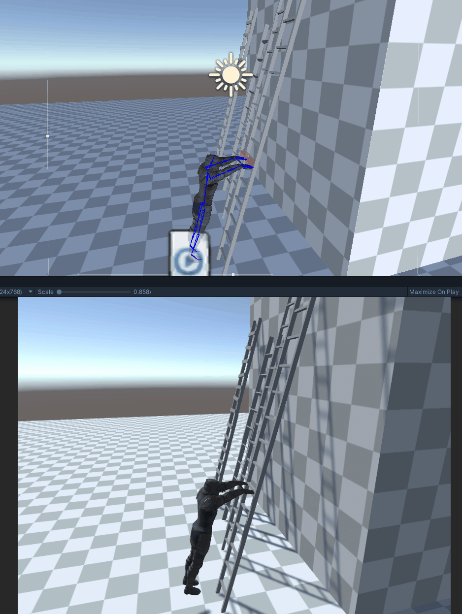
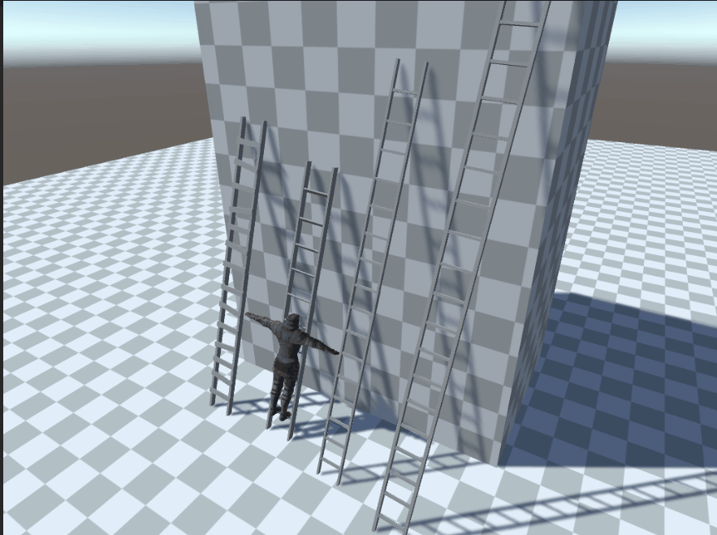

# Climbing Ladder

This challenge was suggested by "XENDAL_INC#3750"
Time spent: 2 Hrs
Final Result



To download the project, the zip file  [_02_ClimbingLadder.zip](_02_ClimbingLadder.zip) at the top of the repo
Unity Version: 2019.4.25f1

## Idea
In this challenge, I wanted to experiment with something new which is the animation rigging package. I have tried it before but I haven't completed anything with it. So, I thought that today was the time.

## Execution
I downloaded the model from mixamo and tried getting a climb animation but I wasn't able to fit it with the AnimationRigging package. So, decided to work from the T-Pose.

Started with a simple moving up with the ladder direction and thought that I am 90% there. The only thing missing is making his arms attach to the step.



Each ladder has how long 1 `step` is to know where hands should be placed vertically and the `stepWidth` to know how wide the step to place the arms far apart.
```cs
    public class Ladder : MonoBehaviour
    {
        [SerializeField] float step = 0.35f;
        [SerializeField] float stepWidth = 1f;
    }
```


The logic that calculates the hand player placment was very messed up and I couldn't figure out where exactly the arms should be. My intial thought was a counter that increments every 2 steps and increment by 2 steps but it didn't work.

I was able to get how many steps the player have passed and I am sure I have all the numbers that would lead to the correct calculation of the hands placment, but ... the challenge ended so, better luck for me next time 🤷‍♀️