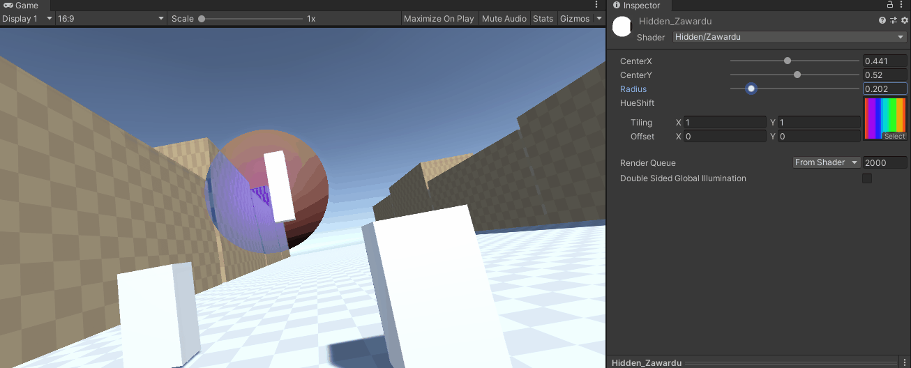

# Time for stop 5 seconds
This challenge was suggested by "mostafa_8bit#9237"

Time spent: 3 Hrs

Experiment and download the project zip [_03_TimeStopFor5Seconds.zip](_03_TimeStopFor5Seconds.zip) if you want

Unity Version: 2019.4.25f1

Final Result


## Idea
In this challenge, the time was supposed to stop for 5 seconds but that's something easily achievable with `Time.TimeScale` or `Time.deltaTime * customFactor`. So, Instead, I decided to try to create "Zawardu" shader.

## Shader Breakdown


It contains
- Avoid "Dio's" distortion ✅
- Apply HUE shift on "Dio" ❌
- Circle that spawns from "Dio's" location ✅
- Distortion (Push objects that are far from the center) ✅
- Distortion (Pull objects that are close to the center) ❌
- HUE shifting ✅
- Invert color only in the circle ✅
- Rings with outline ❌

## Execution

### Avoid Dio Distortion

This was setup using 2 cameras, one that applies the screen effect on it and the other renders Dio's layer and clear flags set to `Depth only`


### Setting up the shader

Following [Harry's great tutorial](https://halisavakis.com/my-take-on-shaders-introduction-to-image-effects/) on how to get started with shaders, the image effect shader was up and ready.

This is done by creating a csharp script that reference the screen effect material and attaching it the camera
```
[ExecuteInEditMode]
public class BlitScreen : MonoBehaviour
{
    public Material material;

    void OnRenderImage(RenderTexture source, RenderTexture destination)
    {
        Graphics.Blit(source, destination, material);
    }
}
```

The material is created from the screen effect shader and is assigned to this slot. Since the script [ExecuteInEditMode], any changes to the shader properties in the material in the project will directly affect the screen.

### Circle Spawn from Dio's location

To make the circle spawn in Dio's location, I should be able to control the position of the circle on the screen. This was done ,also, by following [Harry's circle shader tutorial](https://halisavakis.com/my-take-on-shaders-custom-masks-part-i/) and customizing it a bit


### Distortion (Push objects that are far from the center)

The uvs ranges changes from (0 to 1) to (-1 to 1) by multiplying by 2 and subtracting 1
```
half2 n = i.uv;
half2 d = n * 2.0 - 1.0;
```
The -1 to 1 range is used to distort the image (-1 push left, down and +1 push right and up making the circle distortion). The distortion value is multiplied by the radius value to increase the distortion as the size of the circle increase


### Hue Shifting

The HUE shifting was achieved by apllying a rainbow texture normally on the screen. The texture scrolls horizontally using the radius slider. The texture is tilled using a very small number to cover up only one color at a time. When the radius changes, the color slides causing the affect of hue shift which is masked later by the circle at the beginning

```
float4 hueShift = tex2D(_HueShift,i.uv * 0.1 + _Radius);
```


### Invert color only in the circle

To achieve this, we use a special function called `step` which returns 1 if the pixel value is larger than a specified value and returns 0 otherwise. Using the step function, I was able to create a mask that will specify where the effect should appear. This is also affected by the radius parameter. The (one minus) was used to invert the result and get the white inside

```
half4 circleStepped = 1-step(circleMask, 0.1f);
```


Then, we mix everything together here:
- (1-distortion) * circleStepped: Is the inverted color multiplied by the mask (white inside circle)
- distorion * (1 - circleStepped): The remaining of the image is now black (outside the circle), so we add the non inverted color to the outside
- hueShift * circleMask * 0.4f: Finally, we add the HUE shift only in the white areas in the circle mask and multiply it by a factor to make it lighter

```
 return (1-distorion) * circleStepped + distorion * (1-circleStepped) + hueShift * circleMask * 0.4f;
```

Finally, we can enjoy



Let me know if you have any issues. Thank you ❤