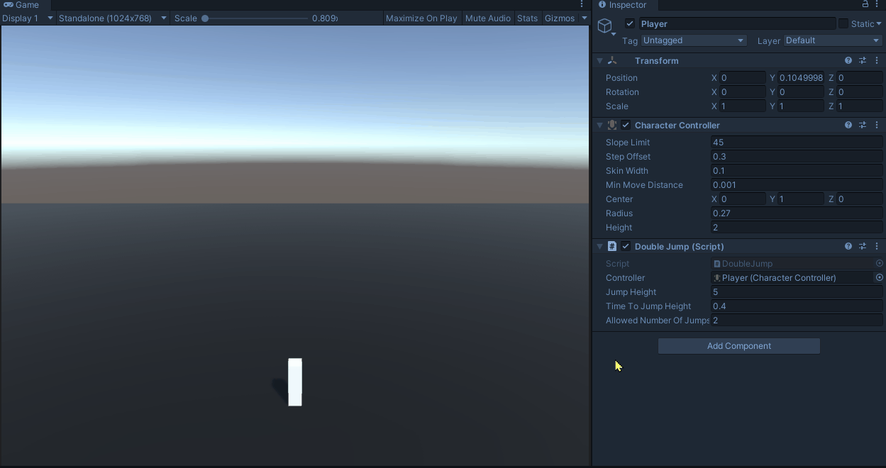

# Time for stop 5 seconds
This challenge was suggested by "SpaceMarco#8068"

Time spent: 20 Mins

There is no need to download the project, copy the [DoubleJump.cs](Assets/DoubleJump/DoubleJump.cs)'s content or download it directly.

Unity Version: 2019.4.25f1

Final Result



## Idea
Double jump. That is based on [Math for Game Programmers: Building a Better Jump by GDC](https://youtu.be/hG9SzQxaCm8). The code was taken from the comment by merkaba48 and modified it a bit.


## Execution
Everything here is just this script called [DoubleJump.cs](Assets/DoubleJump/DoubleJump.cs). These lines in the start are well explained in the video mentioned in the Idea section and jumping was made using Unity's character controller

```cs
_jumpGravity = -(2 * JumpHeight) / Mathf.Pow(TimeToJumpHeight, 2);
_jumpVelocity = Mathf.Abs(_jumpGravity) * TimeToJumpHeight;
```

To allow multiple jumps, 2 varibales were created. A public `allowedNumberOfJumps` holds maximum jumps and can be tweaked from the inspector. The private `currentAllowedJump` sets itself to the maximum and is decremented everytime we jump.
```cs
if (Input.GetKeyDown(KeyCode.Space) && currentAllowedJump > 0)
{
    currentAllowedJump--;
    _velocity.y = _jumpVelocity;
}
```

Finally, the currentAllowedJump resets if we are grounded

```cs
if (isGrounded)
            currentAllowedJump = allowedNumberOfJumps;
```

Let me know if you have any issues. Thank you ❤