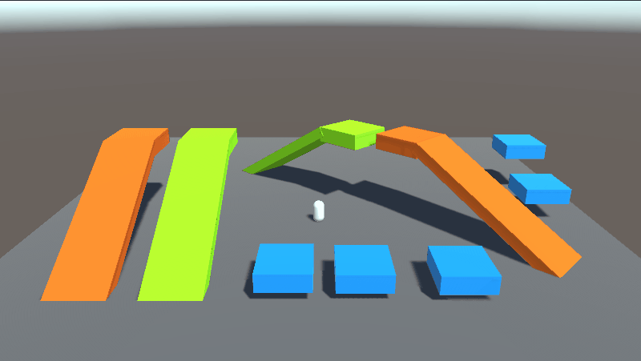
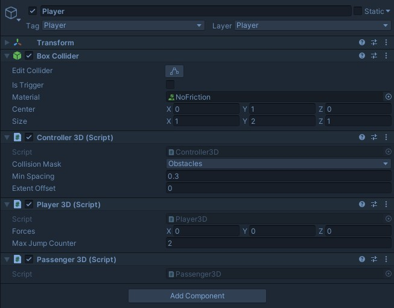
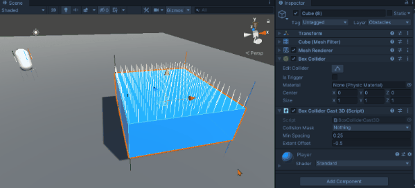
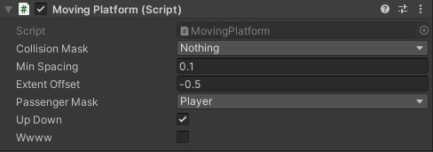
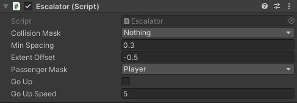
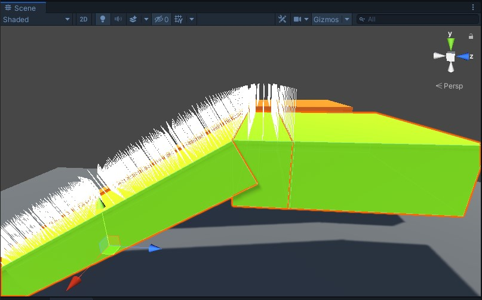
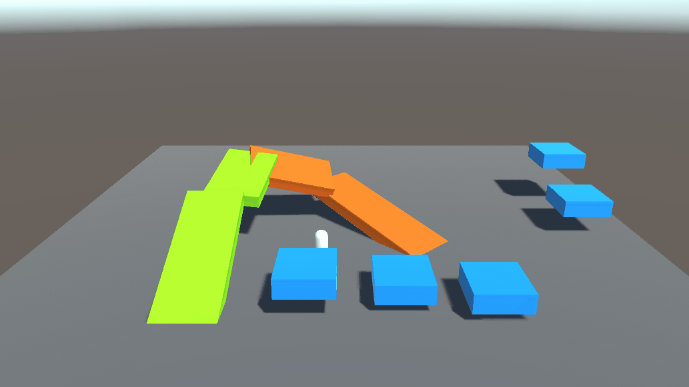
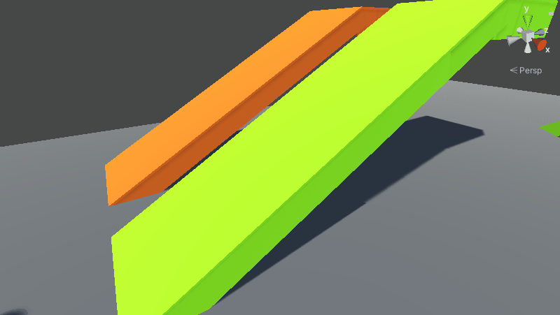
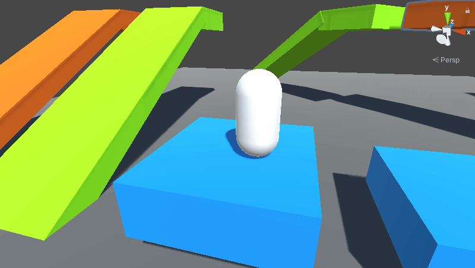

# Escalator
This challenge was suggested by "mostafa_8bit#9237"

Time spent: 16 hrs

Experiment and download the project zip [_07_Escalator.zip](_07_Escalator.zip)

Unity Version: 2019.4.25f1

Final Result




## Idea

The project this time is an Escalator that moves the player up or down. I have always wanted to make a raycast controller instead of using Unity's Rigidbody or CharacterController.

The base controller idea was based on Sebastian Lague tutorial series called [Creating a 2D Platformer](https://www.youtube.com/playlist?list=PLFt_AvWsXl0f0hqURlhyIoAabKPgRsqjz).

Another helpful resource is [krthush / 2d-Unity-Movement](https://github.com/krthush/2d-unity-movement) repositry on github.

Both of them were 2D and what I wanted to do is 3D but they are great references to understand the concept.

## Execution

The execution can be split into:
- Character base raycast movment
- Converting to 3D
- Moving Platforms
- Escalator
- Issues

### 3D Character base raycast movment

As I mentioned earlier, this was heavily based on [Creating a 2D Platformer](https://www.youtube.com/playlist?list=PLFt_AvWsXl0f0hqURlhyIoAabKPgRsqjz) series. The problem is that I wanted it in 3D.

I will quickly go through the componenets (that are explained well in the series) to explain the changes I did.

The base controller tha handles the raycasting is the [BoxColliderCast3D.cs](Assets/3D/Scripts/BoxColliderCast3D.cs). It contains 2 important structs the **RaycastOrigins** and the **CollisionInfo**. The **RaycastOrigins** holds the position of the corner points and is updated everyframe to match the updated position of the object. The **CollisionInfo** holds general info about where the collision is coming from (front, back, left, etc..). This is useful inside the movment script to avoid the player from walking forward if the forward collision is true.

From this base class, derives a class called [Controller3D.cs](Assets/3D/Scripts/Controller3D.cs) which handles the movement. The current supported movement is vertical and horizontal (slopes aren't taken into consideration)

Finally, a [Player3D.cs](Assets/3D/Scripts/Player3D.cs) contains the default variables and the player input logic and calls the controller's move function.

The Passenger will be explained later so ignore it for now.



### Converting to 3D

The task to add another axis was straight forward in the CollisionInfo info and RaycastOrigins as it's just adding some variables

```cs
public struct CollisionInfo
    {
        public bool above, below;
        public bool left, right;
        public bool forward, backward;
    }
```

The major changes was while checking for collisions. For the 2D, it's just firing a ray in the moving direction. For the 3D, it's firing an array of rays on a Plane. So, if the player is moving upward (Y), we should fire rays along the (Z,X) plane that is facing upward.

This is an example of moving upward where rays are fired from the X,Z planes by looping over them. You will see alot of these double for loop wherever there is a collision 😅

```cs
 //x,z plane (Y-axis)
for (int x = 0; x < xPointCount; x++)
{
    for (int z = 0; z < zPointCount; z++)
    {
        Vector3 rayOrigin = direction == -1 ? raycastOrigins.bottomBackwardLeft : raycastOrigins.topBackwardLeft;
        rayOrigin += transform.right * (xPointSpacing * x) + transform.forward * (zPointSpacing * z);

        Debug.DrawRay(rayOrigin, transform.up * direction * rayLength);
    }
```

Another major update is calculating the line spacing for rotated object in space. Initially, it wasn't calculated correctly because I was using the [Transform.TransformPoint](https://docs.unity3d.com/ScriptReference/Transform.TransformPoint.html) function which was based on the relative object scale. Also, Collider.Bounds.Extents were used but the bounds is just an [AABB (Axes Aligned Bounding Box) created behind the scene](https://answers.unity.com/questions/1358341/why-is-bounds-size-changing-when-rotating-a-sphere.html). So, any rotated object will have larger box around it. When I scaled or rotated the object, the points are shifted making the raycast fail to work (since it's out from points away from the real object)




### Platforms

For the platform, I took [krthush / 2d-Unity-Movement](https://github.com/krthush/2d-unity-movement) a reference point. The two main components that controls the player to stick, move, etc.. on the platform is the [Passenger3D.cs](Assets/3D/Scripts/Passenger3D.cs) we skipped previously and the [PassengerMover3D.cs](Assets/3D/Scripts/PassengerMover3D.cs). The **PassengerMover3D** holds a reference for all the **Passenger3D** that are collided with it and then executes an abstract function that each derived class implement to customly move the passengers.

Since the **PassengerMover3D** need to have bounds to know that a passenger collided with it, it derives directly from the **BoxColliderCast3D**. It's also an abstract class with the **CalculatePassengerMovement** abstract function.

The [Platform.cs](Assets/3D/Scripts/Platform.cs) derives from the **PassengerMover3D** and implements the logic based on the github repo mention above but by turning the collision checks to 3D instead.

Basically the pseudo code is something like this:

The last check is what makes the player stick on top of the platform if it's moving horizontally.
```
if displacment in y axis
    push passenger in y direction
if displacment in x axis
    push passenger in x direction
if displacment in z axis
    push passenger in z direction

if displacment in y is negative (Going Downward) 
OR
if displacment in y is zero but not in X or Z (Platform moving horizontally)
    push passenger in the same direction as the platform
```

The platform on itself does nothing. That's why there is a [MovingPlatform.cs](Assets/3D/Scripts/MovingPlatform.cs) that inherits from the Platform. For testing purpose, the moving platform only moves on X,Y axis between it's original position using a Sin wave.

Nothing fancy about it. The `Wwwww` property is just going both in up and down simultaneously but it's collision is not working corectly that's why it wasn't given a correct name.



### Escalator

The [Escalator.cs](Assets/3D/Scripts/Escalator.cs) also derives from the **PassengerMover3D** and implements it's own movment logic. It's component is straightforward.



At the Start of the function, the BottomLeft and BottomRight bounds are taken as the reference to calculate the direction of the escalator. This direction is used to push the player forward. The player will be pushed forward as long as it's inside the escalator bounds. When the player reached the top of the escalator, it got stuck, so to fix it, I made a small escalator that will push the player to the gound at the end.



So, in general it can be used as a general purpose moving the character. You can do this but it's not that useful.



### Issues

The main issue in this project is that the slopes movment aren't yet handeled (Only vertical and horizontal movment). This wasn't implemented becasue I am not yet familiar with the Maths for slopes and how to convert this to 3D. One day I will 😞

This makes the player clip inside the escalator if the player tries to move inside it



Another issue is with the moving up platform. Whenever it starts moving up, the player gets scared. This messes up with the collision and the player doesn't stick to horizontally moving platform and a lot of clipping and weird stuff 😭




Other than this, I enjoyed it.
Let me know if you have any issues. Thank you ❤