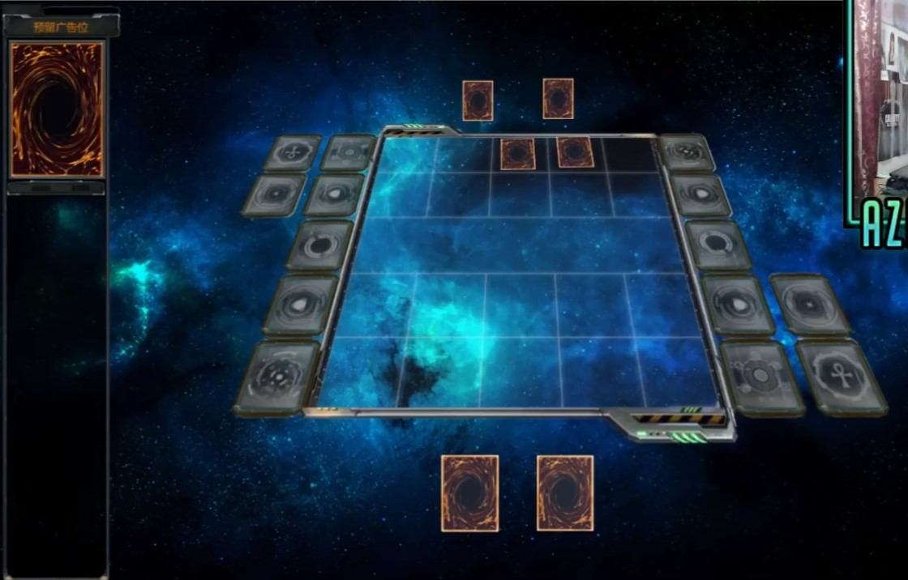
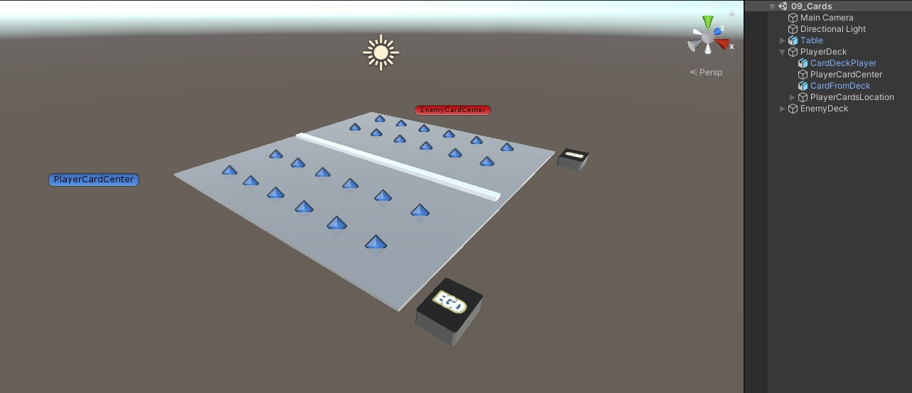
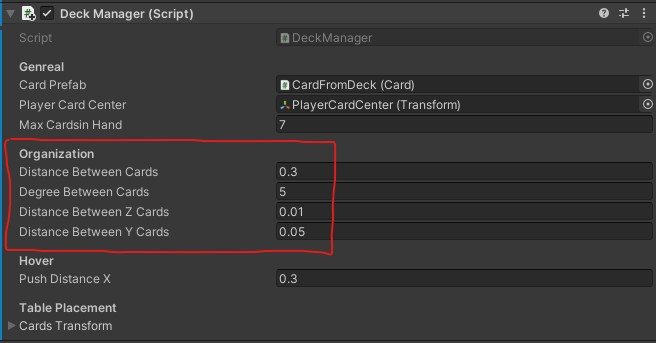
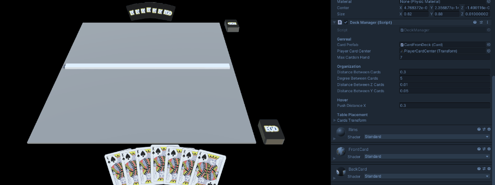
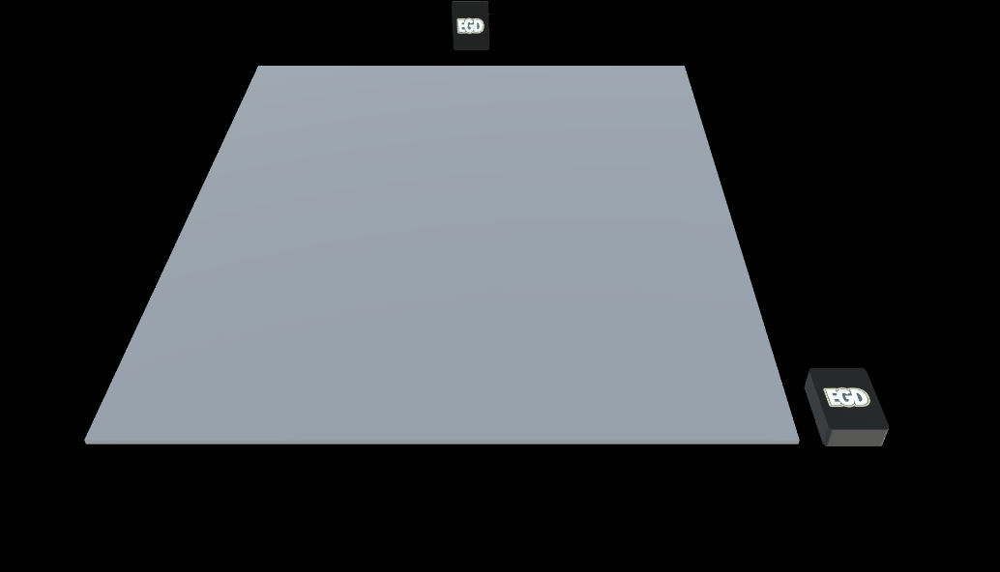
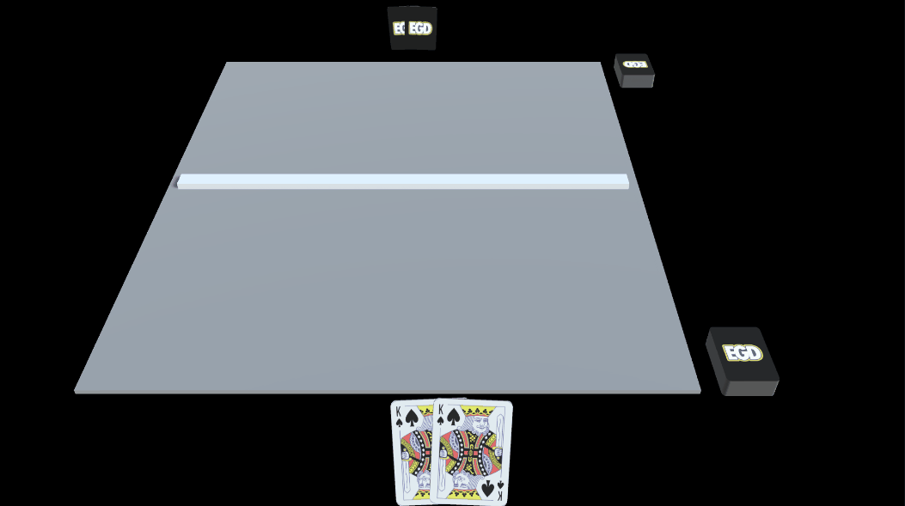
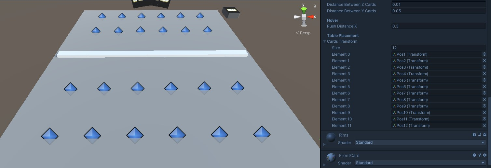

# Draw Card and Place in Field
This challenge was suggested by "kaj-S#7493"

Time spent: 8 hrs

Experiment and download the project zip [_09_CardFromDeck.zip](_09_CardFromDeck.zip)

Unity Version: 2019.4.25f1

Final Result


## Idea

This project was simulating any table/ board game. I didn't have time to implement turns or logic or even what a card is. All cards are kings and a King is the strongest Yugi card.

Before starting, I like to gather some references to know what I am going to create. The camera angle, fov and deck location was inspired by Yugi3D game called YGO 3D from this [youtube video](https://www.youtube.com/watch?v=qzBPSw6dW8E). For the cards placment and movment, this was my refernce a great game found on twitter based on [this tweet](https://twitter.com/IbeDenaux/status/1426603373973868547)



## Execution

The execution can be split into:
- Scene Setup
- Organizing Cards in hand
- Hovering and Animations (Using [DoTween](https://assetstore.unity.com/packages/tools/animation/dotween-hotween-v2-27676))
- Card Placment on the table

### Scene Setup

The scene setup is pretty straight forward. The table and cards were modeled in blender and set up in Unity. There are only 2 scripts:
- [DeckManager.cs](Assets/09_Cards/Scripts/DeckManager.cs): Resonsible for card drawing, hovering and placing cards
- [Card.cs](Assets/09_Cards/Scripts/Card.cs): Detects mouse input and send it to DeckManager



### Organizing Cards in hand

For organizing the cards in the player's hand, there is an empty object that is supposed to be in the center where cards should spawn. Following the great twitter reference ([this tweet](https://twitter.com/IbeDenaux/status/1426603373973868547)) when adding new cards, they space out evenely from the center, they rotate a bit, the curve a bit around the x-axis and finally, they move forward a small bit so that they don't overlap.

To achieve this each variable mention before can be changed from the DeckManager under the Organization header.



Let's see how this works. Let's take the example of the distance between cards as 0.5.

If there is only one card. There is no distance, making it's position 0.

If there are 2 cards, the distance distance between each card is 0.5 but we want to center it so the positions are going to be -0.25 and 0.25 so that they are centered around 0.

How is this achieved in code? We first calculate the position of the first (left most) card, then each loop iteraction, we increment this value by the distance. So following the previous example, if there are 2, we will calculate the -0.25 and we will add 0.5 in the next iteration and we would get 0.25

First of all, this is all depends on the card count and if there is only one card, we don't want any offset. So, we wil use `childCount - 1`. Next is we don't want to toal distance, we want half of it, (if we have 0.5 as distance between card, we want -0.25 and 0.25). For this reason, we multiply by (0.5) to half the distanceBetweenCards. Finally, since we are going to start from the leftmostCard, we add a -ve before the distanceBetweenCards.
```cs
 float offsetX = -distanceBetweenCards *  0.5f * (float)(childCount - 1f);
```

This is applied the same for the other parameters as well. The `0.5f * (float)(childCount - 1f)` was being repeated a lot so I stored it in a variable and called it `magicFactor`. This can be found in [DeckManager.cs](Assets/09_Cards/Scripts/DeckManager.cs) in the `OrganizeCards` function




### Hovering and Animations

The hover function is in the [DeckManager.cs](Assets/09_Cards/Scripts/DeckManager.cs) called `HoverCard(int index)`. It's logic is exactly the same except for 2 things. First, the selected card to hover is given some hard coded value to be above all cards with no rotation. Second, the push distance value is used to push the cards with respect to how close they are to the original card.

To achieve the second thing, the offset value had some other value added to it. 

Let's break it down, i - hoverIndex will return a signed value based on how far the card is. Example, hoverIndex is 3 so i=2 will be -1 because the card is on it's left and i=4 will be 1 as the card is the right of push distance. We take how far the card is and 1/distance to decay the push effect exponentially.
```cs
pos.x = offsetX + (1f / ((float)i - (float)hoverIndex) * pushDistanceX);
```



For the animations, the magic of [DoTween](https://assetstore.unity.com/packages/tools/animation/dotween-hotween-v2-27676) does everything or any Tween Library of your choice. Instead of changing the local position, we just use DoLocalMove and specify the time which in my case is 0.1f
```cs
 //card.transform.localPosition = pos;
 card.transform.DOLocalMove(pos, 0.1f); //DoTween Magic ♥
```



### Card Placment on the table

The card placment was done in the most lazy way, The transforms where the card should go are in the scene. To place a card, the card moves to be a child to this transform. Before placing a card, we `GetFirstEmpty` which just loops over all the transforms and get the first transform that has zero childs. Since the placment is just changing position, so applying [DoTween](https://assetstore.unity.com/packages/tools/animation/dotween-hotween-v2-27676) magic makes it butter smooth.




That's it, hope you like it.

Let me know if you have any issues. Thank you ❤